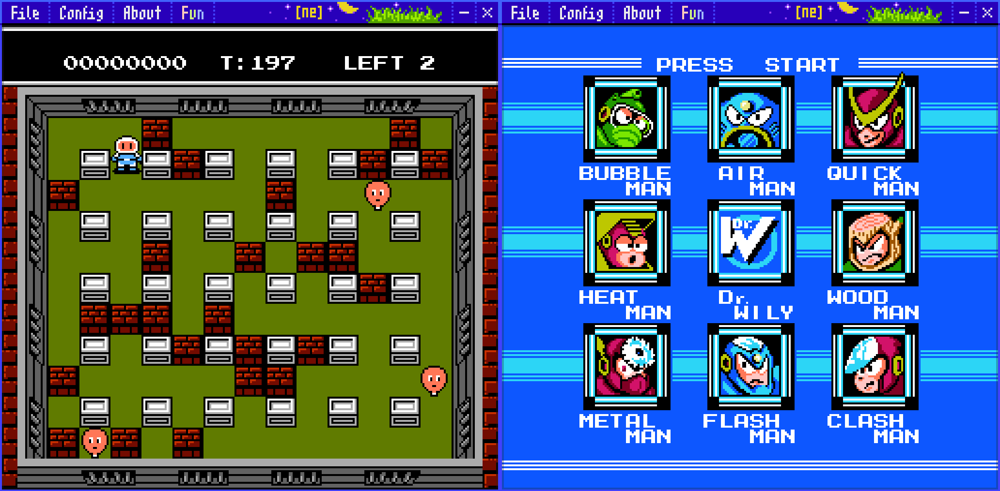
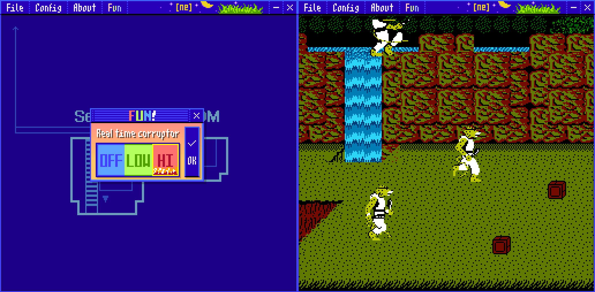

I've always wanted to write an emulator, so 3 months back I repurposed code I wrote for a 2A03 decoder to make an NES emulator.

For most of development I used [this](https://www.masswerk.at/6502/6502_instruction_set.html)* resource and of course [NESdev Wiki](https://www.nesdev.org/wiki/Nesdev_Wiki) and [NESdev Forums](https://forums.nesdev.org/). It would be impossible to do without their research. I don't have NES or Famicom. I would like to attempt to make an emulator from hardware only someday, but it will take much longer and I don't understand electronics yet.

Special thanks to [Vasily](https://github.com/vtereshkov) for testing and giving me motivation to work on it. I've found a friend while making this emulator, and he provided some fixes and advice, and in general motivated me to continue working on this, special thanks to him!

*Ricoh 2A03 and 6502 have differences but it's a nice manual also it has mistakes >:(

You can download it in the releases, if you want to build you will need MSVC 2022. Using VS Developer Command Prompt for x64 run `misc\get_sdl3.bat` and `misc\quick.bat`. Enjoy!

# Game Support

Look at the links, it has the supported games. (Not all games are supported, check issues)

| Mapper | Info                                 | Games supported                              |                                              
|-------:|--------------------------------------|----------------------------------------------|
| 0      | Works!?*                             | https://nesdir.github.io/mapper0.html        |
| 1      | Seems to work                        | https://nesdir.github.io/mapper1.html        |
| 2      | Seems to work                        | https://nesdir.github.io/mapper2.html        |
| 3      | Seems to work                        | https://nesdir.github.io/mapper3.html        |
| 7      | Battletoads crashes**                | https://nesdir.github.io/mapper7.html        |
| 228    | Cheetahmen 2 crashes the emulator :? | https://nesdir.github.io/mapper228.html      |

*It'd be emulator bug not mapper bug, Slalom works but it looks terrible.
**Bad PPU implementation

# Limitations

- No APU PCM
- PPU is badly written, it's not like real the PPU works, so I'd rather rewrite it later but most games should work.
- Undocumented instructions aren't implemented.
- It still sometimes crashes, for example Cheetahmen 2.
- No PAL support.
- Right now it expects your monitor to be 60hz. On 144hz games will run very fast.
- I don't filter both RL/UD keypresses which are impossible on dpad, so some wonkiness will happen.
- I don't know what open bus is, but some games rely on it.
- There's probably more that I forgot

# Real Time Corruptor (RTC)

> Every single enemy became Cheetahmen. But maybe using Action 52 is cheeting... Sorry.

Real time corruptor corrupts games in real time...

Low mode is low-key but faster than High mode. Technical: it picks a random location from ran (that isn't the stack), and increments or decrements the value (if the value is 0xFF it always subtracts, if the value is 0x00 it always adds). 

High mode is slower than Low mode, but it changes values in RAM to a random value, this would crash the games more often, but maybe you'll find something more fun.

# Todos and notes

I'm a bit lazy as of writing this, so Linux support will come later. 

It has gamepad support, but you need to connect the gamepad before starting the emulator, I know some emulators do it and it's very annoying, I'm lazy right now.

I removed the feature of loading ROM's from CLI parameter at some point, it was nice.